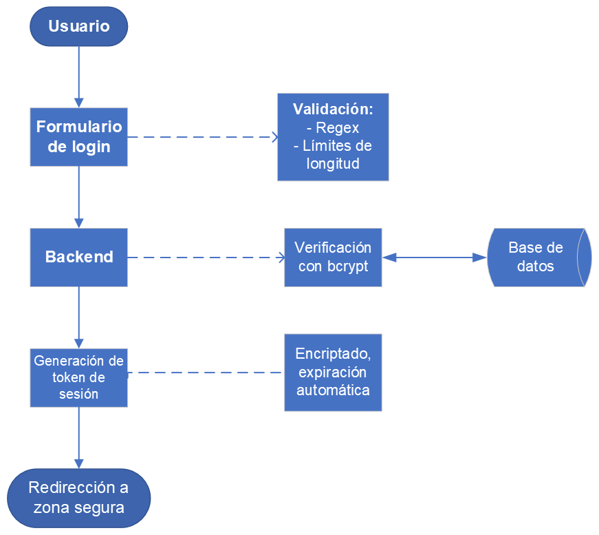
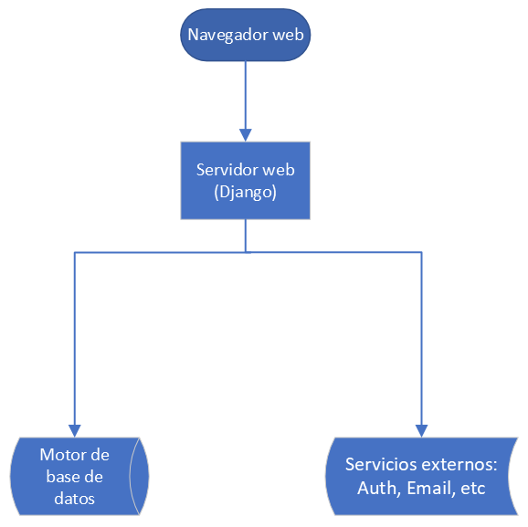
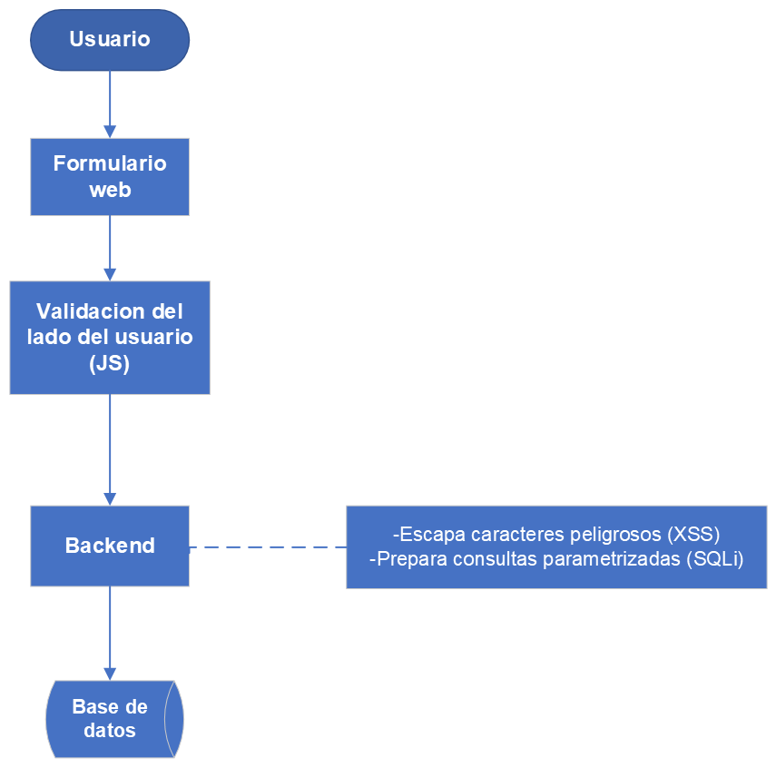

# Propuesta de Mejora Técnica – Plataforma EIEInfo  
**Semana 3 (23–29 de junio)**  
**Fecha de entrega: 29 de junio**

## Profesor: Esteban Badilla Alvarado 

## Integrantes:

- Emmanuel Avilés Ramírez (C20883) 
- Diego Acosta Obando (C00041)
- Josue Zúñiga Jiménez (B98738)

---

## 1. Objetivo  

El presente documento tiene como propósito identificar e implementar al menos tres mejoras técnicas, respaldadas por evidencia empírica obtenida a partir de entrevistas, análisis estático con herramientas como SonarQube y principios reconocidos de ingeniería de software. El objetivo es optimizar la **funcionalidad, seguridad y usabilidad** del sistema EIEInfo, elevando así su calidad técnica y experiencia de usuario.

---

## 2. Áreas de Mejora Identificadas

### Mejora 1: Implementación de pruebas automatizadas (Testing Coverage)  

**Evidencia Técnica:**  
- **Cobertura actual de pruebas:** 0.0% (SonarQube).  
- **Riesgo asociado:** Aumenta la probabilidad de defectos no identificados antes del despliegue en producción.

**Justificación Técnica:**  
La cobertura de pruebas (code coverage) permite cuantificar la proporción del código fuente que ha sido verificada mediante pruebas automatizadas. Una cobertura adecuada contribuye significativamente a la estabilidad del sistema, facilita el mantenimiento y reduce el costo de errores en etapas avanzadas del ciclo de vida del software.

Implementar herramientas como `coverage.py` para código Python y el software `Ranorex Studio` para pruebas funcionales de GUI garantiza un enfoque integral, abarcando tanto el backend como la interfaz gráfica del usuario.

**Herramientas Sugeridas:**  
- `coverage.py` – Para análisis de cobertura de pruebas unitarias.  
- `Ranorex Studio` – Para pruebas automatizadas de interfaces gráficas.  

**Ejemplo Técnico:**
```python
def test_usuario_login_exitoso():
    usuario = crear_usuario("profesor", "contra123")
    resultado = login(usuario.nombre, "contra123")
    assert resultado is True
```

---

### Mejora 2: Refactorización para reducir duplicación de código  

**Evidencia Técnica:**  
- **Porcentaje de duplicación:** 29.3% en 279,000 líneas de código (SonarQube).  

**Justificación Técnica:**  
El principio **DRY (Don't Repeat Yourself)** es un pilar fundamental del diseño limpio y sostenible. La duplicación excesiva no solo incrementa la deuda técnica, sino que también eleva el riesgo de inconsistencias lógicas y errores al modificar el sistema.

Mediante la reutilización de componentes y plantillas base, se garantiza un sistema más limpio, mantenible y coherente.

**Ejemplo Técnico:**
```html
<!-- Código duplicado antes -->
<div class="usuario-card">
  <h3>{{ usuario.nombre }}</h3>
  <p>{{ usuario.rol }}</p>
</div>

<!-- Reutilización con plantilla -->

```

---

### Mejora 3: Corrección de vulnerabilidades críticas de seguridad  

**Evidencia Técnica:**  
- **Vulnerabilidades registradas:** 377 issues de seguridad.  
- **Problemas tipo Blocker:** 67 (SonarQube).  

**Justificación Técnica:**  
Las vulnerabilidades de seguridad representan un riesgo significativo para la integridad del sistema y la privacidad de los datos de los usuarios. En particular, se identificaron posibles vectores de ataque como **Cross-Site Scripting (XSS)**, **inyecciones SQL**, y falta de **hashing seguro** de contraseñas.

**Medidas Propuestas:**  
- Validación estricta de entradas del usuario mediante expresiones regulares.  
- Implementación de hashing con **bcrypt** y uso de tokens seguros.  
- Configuración adecuada de políticas **CORS** y **encriptación HTTPS**.  
- Uso de tokens temporales y autenticación basada en sesiones.

**Ejemplo Técnico:**
```python
# Validación segura de nombre de usuario
if not re.match(r'^[a-zA-Z0-9_]+$', nombre_usuario):
    raise ValidationError("Nombre de usuario inválido.")

# Generación de token seguro
import secrets
token = secrets.token_urlsafe(32)
```

---

## 3. Diagrama del Rediseño de Autenticación  

A continuación se presenta una propuesta de rediseño para el flujo de autenticación, incorporando validaciones robustas y manejo seguro de credenciales:



---

## 4. Análisis de Impacto: Costo vs. Beneficio  

| Propuesta                            | Costo (Tiempo / Recursos)   | Beneficio Directo                                 | Viabilidad |
|-------------------------------------|------------------------------|---------------------------------------------------|------------|
| Automatización de pruebas           | Medio (inicial)              | Prevención de errores, agilidad en desarrollo     | Alta       |
| Refactorización de código duplicado | Medio                        | Mejora de mantenimiento, reducción de errores     | Alta       |
| Refuerzo de seguridad               | Medio - Alto (según alcance) | Protección de datos sensibles, confianza del usuario | Alta    |


---

## 5. Diagramas Técnicos Complementarios

### Diagrama de Arquitectura Propuesta 




---

### Diagrama de Seguridad: Flujo de Prevención XSS y SQLi




---

## 6. Fragmentos de Código Adicionales

### Validación Extendida de Inputs (XSS y Longitud)

```python
from django.core.exceptions import ValidationError
import re

def validar_input_usuario(input_str):
    if not re.match(r'^[a-zA-Z0-9_.-]{4,30}$', input_str):      # Verifica parametros para el usuario
        raise ValidationError("Input inválido: solo se permiten letras, números y ciertos caracteres.")
```

### Generación y Validación de Tokens de Sesión

```python
import secrets                                      # Módulo para generar tokens seguros y aleatorios
from datetime import datetime, timedelta            # Para controlar vigencia del token

def generar_token_seguro():
    # Genera un token seguro, codificado para URLs, de 32 bytes (~256 bits de entropía)
    return secrets.token_urlsafe(32)

def token_valido(fecha_creacion, duracion_minutos=30):
    # Verifica que el token no haya expirado: ahora < fecha_creación + duración
    return datetime.now() < fecha_creacion + timedelta(minutes=duracion_minutos)
```

### Pruebas Unitarias Adicionales

```python
def test_validar_input_usuario_valido():
    # Prueba que un nombre válido no arroja ningún error (retorna None implícitamente)
    assert validar_input_usuario("usuario_123") is None

def test_validar_input_usuario_invalido():
    try:
        # Intenta validar una cadena con caracteres ilegales (etiqueta HTML)
        validar_input_usuario("<<script>>")
    except ValidationError as e:
        # Verifica que el mensaje de error sea exactamente el esperado
        assert str(e) == "['Input inválido: solo se permiten letras, números y ciertos caracteres.']"
```

### Refactorización con Componentes Reutilizables (Frontend - HTML + Jinja2)

```html
<!-- components/usuario_card.html -->
<div class="usuario-card">                 <!-- Contenedor con clase CSS -->
  <h3>{{ usuario.nombre }}</h3>            <!-- Nombre del usuario (variable dinámica en Jinja2) -->
  <p>{{ usuario.rol }}</p>                 <!-- Rol del usuario -->
</div>

<!-- uso -->
 <!-- Inserta el componente donde se requiera -->
```

---

---

## 7. Conclusión  

Las mejoras propuestas no solo abordan debilidades técnicas identificadas a través de herramientas como SonarQube y entrevistas a tipos distintos de usuarios, sino que representan un avance tangible hacia una verdadera mejora de la página de la escuela, de lo cual todos nos beneficiamos.  

Al implementar pruebas automatizadas, eliminar código redundante y fortalecer la seguridad, se garantiza un sistema más **estable, escalable y confiable**, alineado con las mejores prácticas del desarrollo de software moderno.

Estas acciones no solo beneficiarán al equipo de desarrollo, sino también a todos los usuarios finales, quienes experimentarán una plataforma más fluida, segura y robusta.

---

## 8. Recomendaciones Futuras


 - **Calidad de código**  Configurar **pre-commit hooks** con `black`, `isort`, `flake8`. Estilo uniforme y menos errores triviales. 
 - **Pruebas GUI esenciales** Scripts con **Selenium WebDriver** (login y CRUD principal) ejecutados en GitHub Actions. 
 - **Seguridad automatizada**  Incluir **Bandit** (estático) y **OWASP ZAP** (*action* semanal, solo spider + passive scan). Bloquea vulnerabilidades evidentes (XSS, SQLi) antes de producción. 
 - **HTTPS sin costo** Certificados **Let’s Encrypt** con renovación automática (`cron`) o servir front estático via GitHub Pages. 
 - **Logs útiles**  Activar `logging` con `RotatingFileHandler`; formato JSON. Facilita depuración y auditoría básica. |
 - **Documentación viva**  Mantener una wiki. 
---
