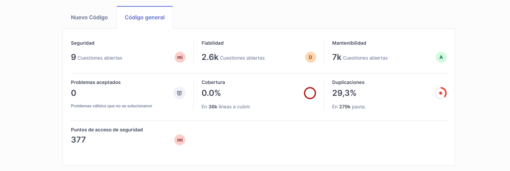
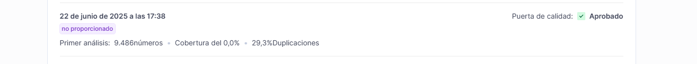
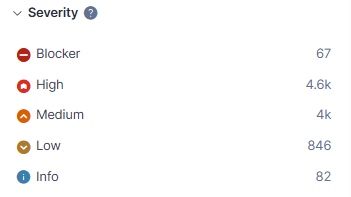
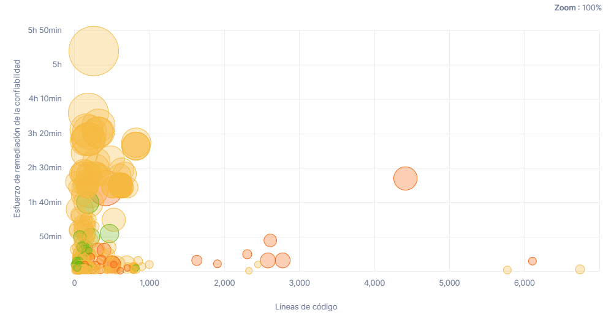
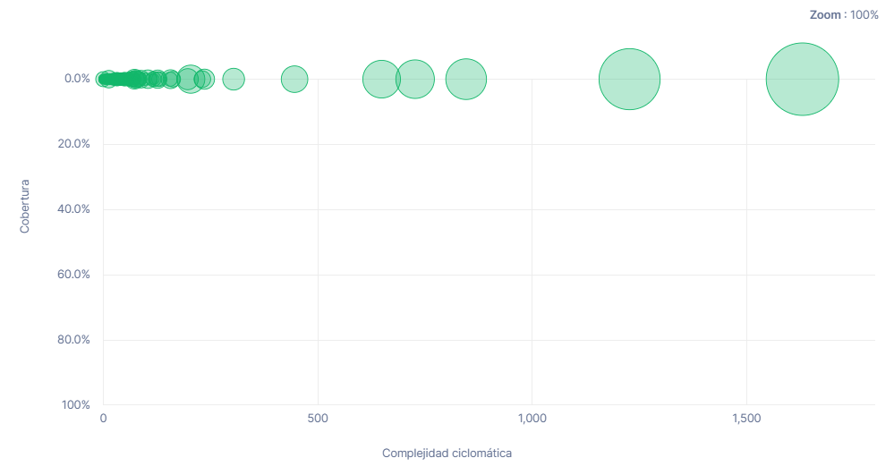
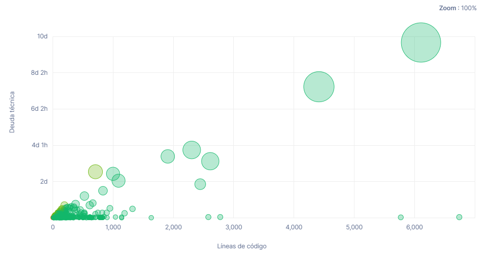
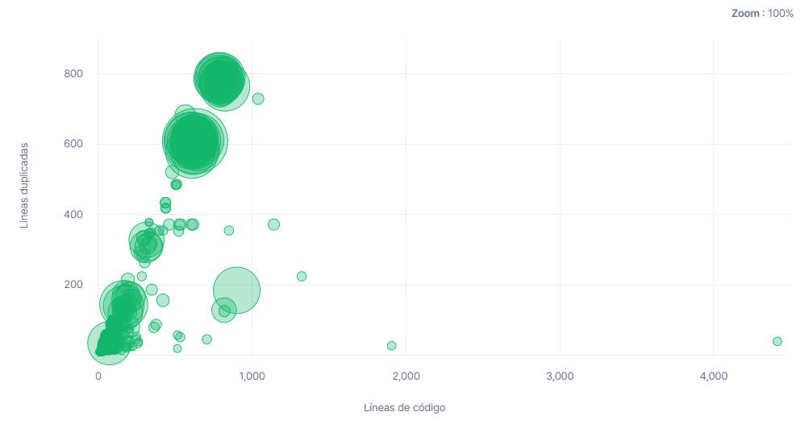
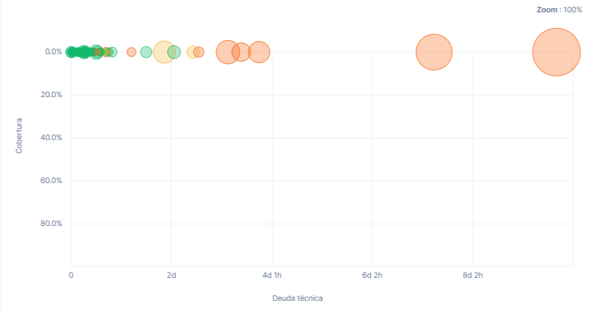
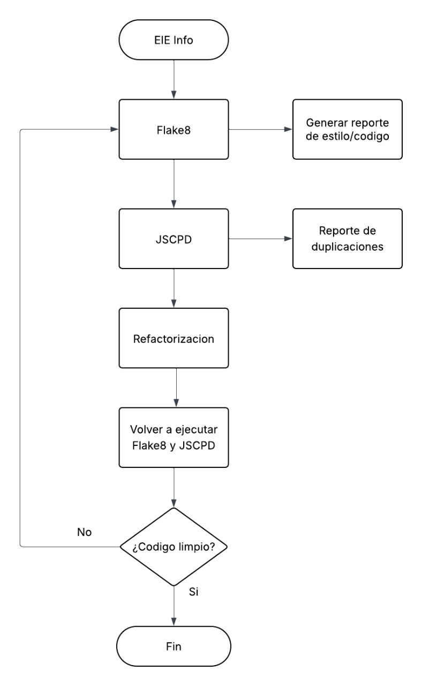
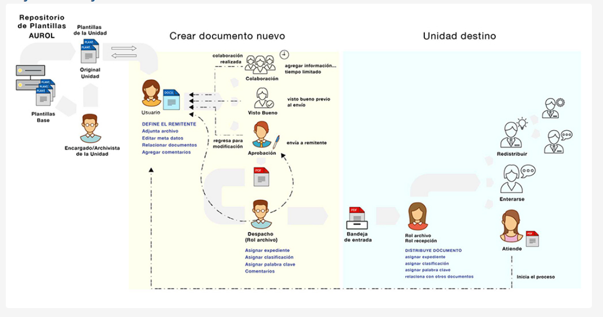

# Proyecto - Informe Técnico
## Profesor: Esteban Badilla Alvarado
## Integrantes:
- Emmanuel Avilés Ramírez (C20883)
- Diego Acosta Obando (C00041)
- Josue Zúñiga Jiménez (B98738)

### Descripción:

El presente proyecto se enfoca en el análisis técnico del sistema **EIEInfo**, una plataforma desarrollada por la Escuela de Ingeniería Eléctrica de la Universidad de Costa Rica. El objetivo principal es comprender a fondo cómo está construido este sistema, evaluar su calidad técnica y funcional, y proponer mejoras que puedan contribuir a su evolución y mantenimiento a largo plazo.
El sistema **EIEInfo** es bastante amplio. No solo gestiona procesos académicos como matrícula y notas, sino que también da soporte a funciones administrativas, de extensión y comunicación interna. A lo largo del curso, el enfoque será actuar como un equipo de consultores que entra a revisar un sistema real, tratando de entender su estructura, cómo fue diseñado, qué tan bien está escrito el código, cómo se despliega y mantiene, y qué tan preparado está para seguir creciendo o adaptarse. 
El sistema está diseñado en **Django**, concretamente su Backend, lo cual da un buen punto de partida porque se trata de un framework robusto, pero también es importante reconocer que al ser un desarrollo hecho por el equipo interno de la escuela, puede haber áreas que no siguen todas las mejores prácticas modernas, especialmente en cuanto a modularidad, documentación o pruebas automatizadas. Por otro lado, el sistema **EIEInfo** emplea la integración de servicios externos como Google y Facebook, utilizando tecnologías como **NGINX**, **Gunicorn**, y **Docker**.

### Diagrama de la arquitectura lógica:

### Diagrama de la arquitectura física:

### Módulos y tecnologías:

| Categoría                | Tecnología                           |
|--------------------------|--------------------------------------|
| Lenguaje Principal       | Python 3.4.3+                        |
| Framework Web            | Django 4.1.3                         |
| Base de Datos            | MySQL                                |
| Servidor de Aplicaciones | Gunicorn                             |
| Servidor Web             | NGINX                                |
| Sistema Operativo        | Linux (Servidor Faraday, con systemd)|
| Despliegue               | Docker (pruebas)                     |
| CI/CD                    | Drone                                |
| Buscador                 | Google Custom Search API             |
| Autenticación Externa    | Facebook API                         |
| Wiki                     | Django-Wiki (fork modificado)        |

| Módulo                     | Función Principal                                                                 |
|---------------------------|------------------------------------------------------------------------------------|
| Gestión Académica         | Matrícula, historial, cursos, calificaciones                                       |
| Perfiles de Usuario       | Roles de estudiante, docente, funcionario                                          |
| Autenticación y Seguridad | Manejo de sesiones y permisos por grupo en Django                                 |
| Comunicación Interna      | Envío de correos y notificaciones (configurable con APIs)                         |
| Educación Continua        | Administración de cursos abiertos y certificados                                  |
| Búsqueda Global           | Búsqueda integrada con Google Custom Search API                                   |
| Documentación y Reportes  | Generación de PDF, LaTeX, Excel, vCards, etc.                                     |
| Administración            | Interfaz administrativa Django para gestión interna                               |
| Archivos y Logs           | Manejo de archivos estáticos y subidos (/var/info)                                |
| Wiki Institucional        | Wiki embebida integrada a la plataforma                                            |

### Plan de trabajo:

# Evaluación de Usuario – Plataforma EIEInfo

Este documento resume las entrevistas realizadas a dos usuarios de la plataforma EIEInfo: una profesora interina y un estudiante de Ingeniería Eléctrica. El objetivo es identificar fortalezas, debilidades y oportunidades de mejora en la experiencia de uso del sistema.

---

## Usuario 1: Sofía Villalobos Brenes  
**Rol:** Profesora Interina

### Frecuencia de uso
- Aproximadamente 1 vez al mes.

### Funciones más utilizadas
- Consulta de información de contacto.

### Problemas reportados
- Caídas ocasionales de la plataforma.

### Opinión sobre velocidad y confiabilidad
- Considera el sistema como “normal” en rendimiento.

### Sugerencias de mejora
- Incluir una sección de noticias actualizada.
- Mejorar la sección de graduación para evitar consultas a secretaría.
- Eliminar la sección de empleo EIE (ya obsoleta frente a Alumni).
- Ampliar la información sobre práctica profesional (especialmente en el formulario de inicio).

### Facilidad de uso
- Fácil de usar.

### Reportes realizados
- Ha reportado problemas, pero no recuerda detalles.

### Importancia del sistema
> “Me parece que es la mejor forma de hacer que los estudiantes puedan conseguir la información sin necesidad de estar preguntando a los administrativos que ya tienen bastante trabajo :)”

---

## Usuario 2: Santiago Arias  
**Rol:** Estudiante de Ingeniería Eléctrica

### Frecuencia de uso
- Uso ocasional: principalmente para historial académico y constancias.

### Funciones más utilizadas
- Resumen de cursos aprobados y pendientes.
- Consulta de notas de cursos anteriores.

### Problemas reportados
- Caídas esporádicas del sitio.

### Opinión sobre velocidad y confiabilidad
- Generalmente carga rápido.

### Sugerencias de mejora
- Modernizar la interfaz (dashboard o app móvil).
- Incluir una guía de uso o tutorial.
- Mejorar el sistema de búsqueda interna.

### Facilidad de uso
- La navegación no es intuitiva al inicio; se aprende por experiencia.

### Reportes realizados
- No ha reportado problemas formalmente.

### Importancia del sistema
> “Es el sistema base de la carrera, sin eso andaría bastante perdido.”

---

## Usuario 3: Margie Sánchez Chavarría
**Rol:** Recepcionista 

### Proceso mas complejo 
- Tramites relacionados con matriculas de inclusion y estudios de graduacion.
> “La escuela ha facilitado el formulario que esta en la pagina.”

### Procesos administrativos 
- Se realiza atencion de tramites de forma presencial en secretaria, por medio de la central telefonica y por medio del correo oficial de la escuela.
- Contestar y trasladar correos.

### Tiempo del proceso
- Ya sea por telefono, correo o de forma presencial depende del tipo de consulta, ya que hay algunas rapidas y otras mas largas. 

### Consultas mas comunes por parte del estudiantado
- Tramites de graduacion. 
- Procedimiento EXMAA.
- Decuaciones curriculares.
- Plan de accion Individual.
- Consultas de practica profesional.
---

## Resumen de Hallazgos Clave

- La plataforma es **fundamental** para la gestión académica tanto para docentes como estudiantes, y aliviana la carga del trabajo del sector administrativo.
- Las funciones principales **son útiles y valoradas**, pero el sistema presenta **limitaciones en experiencia de usuario**.
- Se identifican problemas recurrentes como **caídas del sistema** y **falta de soporte interactivo**.
- Se recomienda:
  - Mejorar la **usabilidad y diseño**, adaptándolo a estándares modernos de UX.
  - Incluir **notificaciones automáticas** y una **búsqueda eficiente**.
  - Eliminar secciones obsoletas y **mantener actualizada la información clave**.
  - Desarrollar una **versión móvil oficial** o aplicación complementaria.

---

> Este documento forma parte de un proceso de mejora continua de la plataforma EIEInfo y busca visibilizar la voz de sus usuarios para futuras decisiones de diseño y desarrollo.

# SonarQube
## Analisis general:

En general los resultados arrojados por SonarQube muestran un panorama muy positivos. Por otro lado, el análisis sugiere que el sitio web necesita mejorar su seguridad y fiabilidad. Además, se sugiere implementar testing automático para elevar la cobertura, y reducir las duplicaciones mediante refactorización para que el proyecto sea más sostenible.

- **Seguridad:**  La calificación es la mas baja del índice de calidad. El código posee **377 puntos de acceso de seguridad** y **9 cuestiones abiertas**, lo cual debería de revisarse para evitar fugas de información

- **Fiabilidad:** Posee **2.6k cuestiones abiertas**. La calificación de Fiabilidad también es baja, estos errores potenciales podrían provocar fallos en tiempo de ejecución. Una califica D sugiere que la base de código es propensa a bugs.

- **Mantenibilidad:** La calificación es A, lo que es positivo, lo que significa que a pesar de  tener **7k cuestiones abiertas**, la proporción o el impacto de esos problemas es bajo. Esto sugiere que los problemas son mayormente de estilo y no críticos para el mantenimiento.

- **Cobertura:** La cobertura es de **0.0%**, lo que podría deberse a que no se han realizado tests automáticos en el código, esto puede impedir que se detecten errores automáticamente antes de desplegar cambios.

- **Duplicación:** El porcentaje de Duplicación es **29.3%** sobre **279k líneas**. Es significa que alrededor de una tercera parte del código se repite. Lo que puede provocar errores.

- **Problemas aceptados:** No existen problemas aceptados, lo que significa que no hay debilidades encontradas o también, podría deberse a que nadie ha realizado un análisis a profundidad sobre la jerarquía de problemas a resolver.

- La **Severidad** clasifica los problemas según su impacto potencial en la calidad del código. Los **Blocker** son problemas críticos, que pueden provocar que el sistema falle por completo o que sea inseguro o inutilizable. Los problemas **High**, son errores severos que pueden provocar fallos en entornos productivos. Los **Medium** representan problemas que impactan la calidad y el mantenimiento, pero que no detendrán el sistema.**Low** y **Info** son **Issues menores**, y se refieren mas convenciones del código y sugerencias informativas que ayudan a mejorar la legibilidad y consistencia del código.

- De acuerdo con el análisis realizado por **SonarQube**, el código posee varias categorías de problemas. Los 67 problemas de categoría **Blocker** son la mayor urgencia, dado a que representan los riesgos más serios para la estabilidad, seguridad o funcionamiento del sistema. Posteriormente, se podrían abordar los **4.6k** problemas **High**, ya que tienen gran impacto en calidad y experiencia del usuario, y por ultimo los **Low** y **Info**.

## Graficos:

### Fiabilidad:

### Cobertura:

### Mantenibilidad:

### Duplicacion:

### Riesgo:

# Posibles mejoras

### Mejora 1: Implementación de pruebas automatizadas (Testing Coverage)  

**Evidencia Técnica:**  
- **Cobertura actual de pruebas:** 0.0% (SonarQube).  
- **Riesgo asociado:** Aumenta la probabilidad de defectos no identificados antes del despliegue en producción.

**Justificación Técnica:**  
La cobertura de pruebas (code coverage) permite cuantificar la proporción del código fuente que ha sido verificada mediante pruebas automatizadas. Una cobertura adecuada contribuye significativamente a la estabilidad del sistema, facilita el mantenimiento y reduce el costo de errores en etapas avanzadas del ciclo de vida del software.

**Medidas Propuestas:**
Implementar herramientas como `coverage.py` para código Python y el software `Ranorex Studio` para pruebas funcionales de GUI garantiza un enfoque integral, abarcando tanto el backend como la interfaz gráfica del usuario.  
- `coverage.py` – Para análisis de cobertura de pruebas unitarias.  
- `Ranorex Studio` – Para pruebas automatizadas de interfaces gráficas.  

---

### Mejora 2: Refactorización para reducir duplicación de código  

**Evidencia Técnica:**  
- **Porcentaje de duplicación:** 29.3% en 279,000 líneas de código (SonarQube). 
- **Riesgo asociado:** Aumenta la deuda tecnica y aumenta la posiblidad de un mal rendimiento del sistema. 

**Justificación Técnica:**  
- El principio **DRY (Don't Repeat Yourself)** es un pilar fundamental del diseño limpio y sostenible. La duplicación excesiva no solo incrementa la deuda técnica, sino que también eleva el riesgo de inconsistencias lógicas y errores al modificar el sistema. Mediante la reutilización de componentes y plantillas base, se garantiza un sistema más limpio, mantenible y coherente.

**Medidas Propuestas:**
- Implementacion de herramientas como **flake8** para hallar de forma precisa patrones de codigo erroneos.
- Implementar el de **jscpd** para dectar y corregir duplicidad estructural.
---

### Mejora 3: Corrección de vulnerabilidades críticas de seguridad  

**Evidencia Técnica:**  
- **Vulnerabilidades registradas:** 377 issues de seguridad.  
- **Problemas tipo Blocker:** 67 (SonarQube).  

**Justificación Técnica:**  
Las vulnerabilidades de seguridad representan un riesgo significativo para la integridad del sistema y la privacidad de los datos de los usuarios. En particular, se identificaron posibles vectores de ataque como **Cross-Site Scripting (XSS)**, **inyecciones SQL**, y falta de **hashing seguro** de contraseñas.

**Medidas Propuestas:**  
- Validación estricta de entradas del usuario mediante expresiones regulares.  
- Implementación de hashing con **bcrypt** y uso de tokens seguros.   
- Uso de tokens temporales y autenticación basada en sesiones.

### Mejora 4: Alivianar la carga de trabajo administrativo y agilizar procesos

**Evidencia:** Sofía menciona que en su opinión el hecho de que la página le ayude al sector administrativo a agilizar el trabajo que tienen. Entonces también se conduce una entrevista con Margie Sánchez,, recepcionista de la escuela.

**Justificación:** Ya se ha hecho un buen trabajo con agilizar ciertos trámites al brindar sus respectivos formularios, como los estudios de graduación, matrícula por carta, o bien mejorar el trámite como con el cambio de énfasis.

**Medidas propuestas:**
- Hacer una sección de preguntas frecuentes (FAQ) para disminuir la cantidad de consultas que se le hacen a recepción, como trámites de graduación, procedimiento EXMAA, procedimiento para el PAI, etc.
- Integrar una sección de solicitud de trámite la cual notifique automáticamente a profesores para que así recepción no tenga que contestar y redirigir correos triviales que pueden ser manejados con respuesta automática.
- Realizar un sistema que ayude con clasificar archivos para agilizar el proceso de inclusión de archivos al Sistema de Gestión de Documentos Institucional SIGeDI

## Análisis de Impacto: Costo vs. Beneficio  

| Propuesta                            | Costo (Tiempo / Recursos)   |  Beneficio |
|-------------------------------------|------------------------------|------------|
| Automatización de pruebas           | Medio/Alto (inicial)         | Reducción de deuda técnica con revisión automática       |
| Refactorización de código duplicado | Medio/Alto                   | Disminuiría la deuda técnica y podría agilizar futuras implementaciones       |
| Refuerzo de seguridad               | Medio/Alto                   | El uso de tokens aportaría mucho a la seguridad de datos  |
| Funciones para sector administratico  |         Medio              | Alivianaría la carga de dicho sector mediante procesos automatizables       |

---

# Diagramas de Arquitectura:

---

#  Conclusión  

En conclusión, las mejoras propuestas abordan debilidades técnicas identificadas a través de la herramienta SonarQube, e implementaciones a partir de datos recopilados de entrevistas a tres tipos de usuarios clave en la escuela, buscando lograr así una verdadera mejora de la página de la escuela, de la cual todos nos beneficiamos.  
Al implementar pruebas automatizadas, eliminar código redundante y fortalecer la seguridad, se garantiza un sistema más **estable, escalable y confiable**, aumentando la calidad del trabajo y disminuyendo la deuda técnica para que futuros estudiantes que deseen trabajar en el proyecto puedan entrarle sin sentirse tan abrumados al inicio. Estas acciones no solo beneficiarán al equipo de desarrollo, sino también a nosotros los usuarios finales, quienes experimentaríamos una plataforma más fluida, segura y robusta, donde tal vez hasta se pueda crear una mayor cultura de uso de la página.